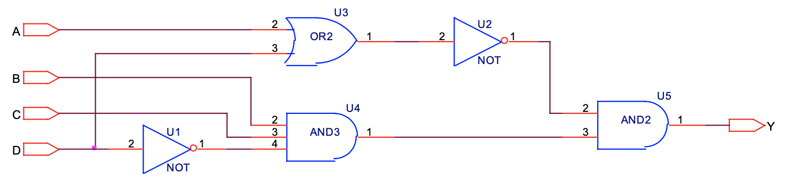
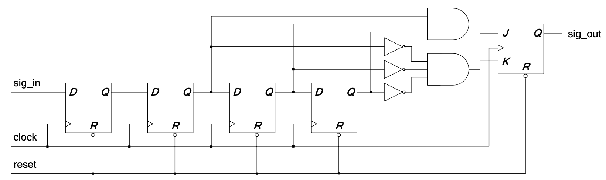
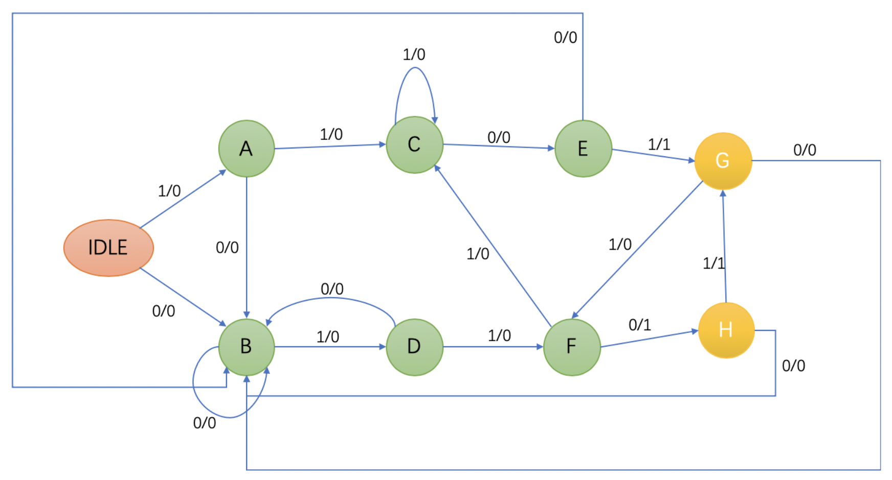
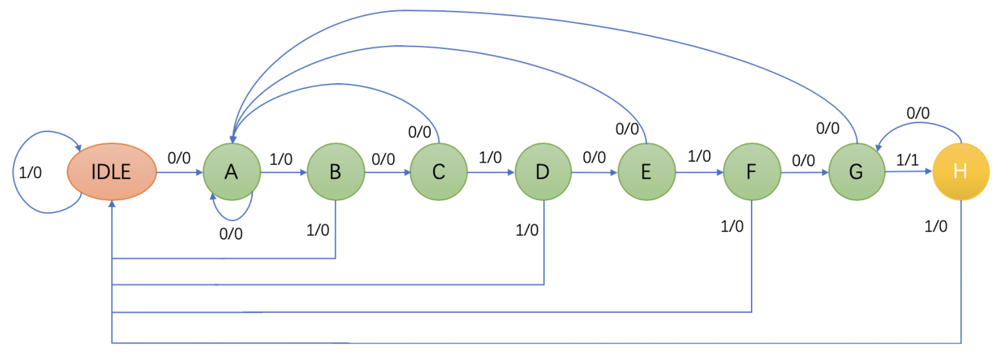
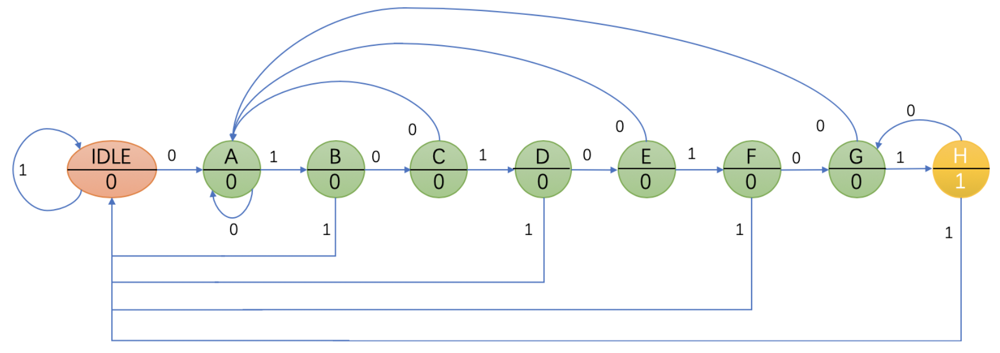

# Digital System Design

### CREDIT 3 *|* SCORE 92 | 3rd year, 1st semester

**Software and Enviroment:** 

- MacBook Pro (13−inch, 2016, Four Thunderbolt 3 Ports)

- macOS Catalina Version10.15.2, Terminal

- Sublime Text v3.2.2, Icarus Verilog version 10.3 (stable) (v10_3), Scansion Version 1.12(1.12)

***

This folder contains some of my course projects. Folder ***Assigments*** contains projects programs(code), folder ***Report*** contains my assigment report(in Chinese, but maybe readable).

- Assignments(Verilog)

  - part_1

    - projects_1: 1-bit and 8-bit comparator
    - projects_2: 2-time Frequency Divider
    - projects_3: Wave Generator and 20-time Frequency Divider
    - projects_4: blocking assignment and nonblocking assignment
    - projects_5: 8-bit selector and ALU

  - part_2

    - project2_1: Wave Generator

    - project2_2: 8x3 Encoder

    - project2_3: 2x1 and 4x1 MUX

    - project2_4: Combinational circuit in Level *Structural, UDP, Dataflow and Behvioral or algorithmic*
    

    - project2_5: Combinational circuit(Dataflow)

    - project2_6: Count the number of 1 in a binary number

    - project2_7: Decimal counter(0 -> 1 -> 2 -> … -> 10 -> 0 -> 1 -> …)(Synchronous reset)

    - project2_8: Combinational circuit(Structural)

    - project2_9: *Linear Feedback Shift Register Research(**LSFR**)(internal feedback)*
      $$
      P(x)=x^{26}+x^8+x^7+x+1
      $$

    - project2_A: *Filter(single module)*
    

    - project2_B: 8-bit Bidirectional cycle counter(0 -> 1 -> 2 -> … -> 255 -> 254 -> 253 -> … -> 1 -> 0)

    - project2_C: 8-bit ***ALU***(always-case)

      | opcode        | function                 |
      | ------------- | ------------------------ |
      | `and`         | $a+b+c_{in}$             |
      | `substract`   | $a+\sim b+c_{in}$        |
      | `substract_a` | $\sim a+b+\sim c_{in}$   |
      | `or_ab`       | $\{1’b0,a|b\}$           |
      | `and_ab`      | $\{1’b0,a\&b\}$          |
      | `not_ab`      | $\{1’b0,\sim a\&b\}$     |
      | `exor`        | $\{1’b0,a\land b\}$      |
      | `exnor`       | $\{1’b0,a\sim \land b\}$ |

    - project2_D: 8-bit shift counter

    - project2_E: ***SRAM***               

    - project2_F: ***Sequence Detector***(`1101` or `0110`)

    - project2_G: ***Sequence Detector***(`10101010`)

      - Mealy machine:
      
      - Moore machine:
      

