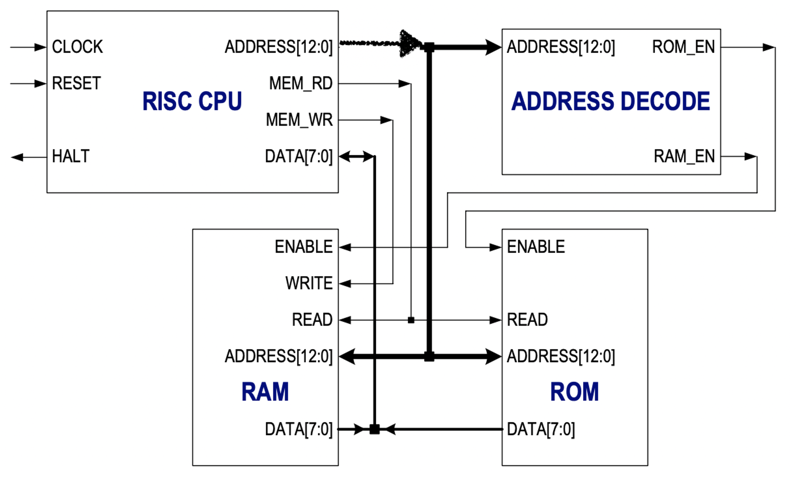
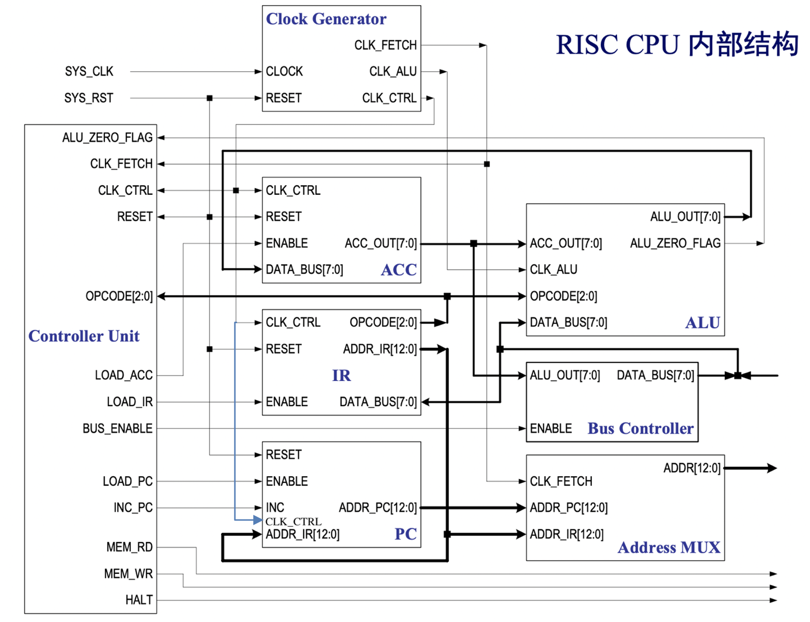

# FPGA Lab.

### CREDIT 2 *|* SCORE 86 | 3rd year, 2nd semester

**Software and Enviroment:**

- MacBook Pro (13−inch, 2016, Four Thunderbolt 3 Ports)
- Simulation
  - macOS Catalina Version10.15.2
  - Terminal
  - Sublime Text v3.2.2, Icarus Verilog version 10.3 (stable) (v10_3), Scansion Version 1.12(1.12)
- Synthesize
  - Windows7
  - Xilinx ISE Design Suite 10.1 sp3
  - Xilinx Spartan-3E FPGA Starter Kit

***

This folder contains some of my course projects. There are some small excercises like rotary LED, not posting.

- RISC_CPU(Verilog): 16-bit instruction(3-bit opcode, 13-bit operand(address)), 8-bit bus, 8-instruction RISC CPU, able to calculate Fibonacci Sequence.
  - RISC: Project of Xilinx

    - 
    - tb_analys.v
    - address_decoder.v
    - RAM.v
    - ROM.v
    - CPU.v
      - machine_ctrl.v
      - machine.v
      - PC.v
      - ACC.v
      - address_mux.v
      - ALU.v
      - bus_controller.v
      - clock_generator.v
      - IR.v
    - Fibonacci.asm: Machine code of Fibonacci Calculating program stored in RAM
  - Report.pdf

